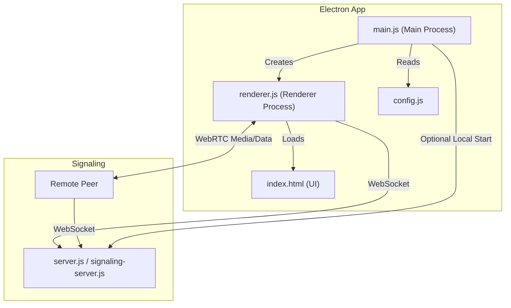

# CreamLine


**CreamLine** is a modern Electron-based screen sharing and streaming application utilizing WebRTC for low-latency, real-time peer-to-peer communication.

---

## 🚀 Features

- **🖥️ Screen Sharing**: High-quality screen streaming to connected peers.
- **⚡ WebRTC**: Powered by WebRTC for minimal latency and direct P2P connections.
- **📡 Signaling Server**: Integrated WebSocket server for seamless connection coordination.
- **🔄 Auto-Updates**: Built-in support for automatic updates via `electron-updater`.
- **🔌 Plug & Play**: Automatic room connection (`room-1`) for instant collaboration.

## 🛠️ Architecture

The following diagram illustrates the internal structure and data flow of the application.



## 📂 Project Structure

| File | Description |
|------|-------------|
| **`main.js`** | **Main Process**: Handles app lifecycle, windows, and auto-updates. |
| **`renderer.js`** | **Renderer Process**: Manages UI interactions and WebRTC logic. |
| **`server.js`** | **Signaling Server**: Standalone WebSocket server for peer discovery. |
| **`index.html`** | **User Interface**: The main application layout. |
| **`config.js`** | **Configuration**: Centralized settings for signaling URLs and rooms. |
| **`electron-builder.yml`** | **Build Config**: Settings for creating the Windows installer. |

## 📦 Installation

Ensure you have **Node.js** installed.

```bash
# Clone the repository
git clone https://github.com/Cresscendoll/CreamLine.git

# Go into the app directory
cd CreamLine

# Install dependencies
npm install
```

## 🚀 Usage

### Development Mode
Start the application locally with hot-reloading:
```bash
npm start
```

### Build for Production
Create a Windows installer (`.exe`):
```bash
npm run dist
```
*The installer will be located in the `dist/` folder.*

### Run Signaling Server
To run the signaling server independently (e.g., on a VPS):
```bash
npm run server
```

## 🔧 Configuration
Settings are managed in `config.js`.
- **Signaling URL**: WebSocket address (default: `localhost` or remote IP).
- **Room Name**: Default room is `room-1`.

---
*Version 1.0.9*


## Configuration

The application uses `config.js` (implied) and environment variables for configuration.
- **Signaling URL**: Configured to connect to a WebSocket server (defaulting to localhost or a specified remote IP).
- **Room Name**: Default is `room-1`.

## Dependencies

- **electron**: Framework for building desktop apps.
- **ws**: WebSocket library for the signaling server.
- **electron-updater**: For handling application updates.
- **electron-builder**: For packaging the application.
